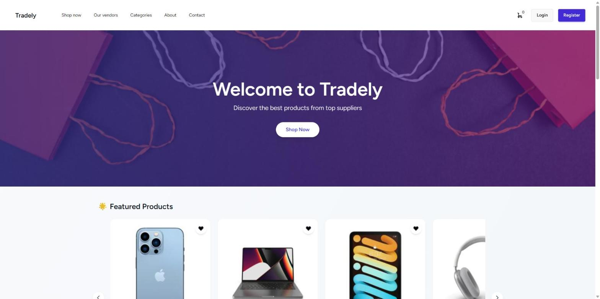
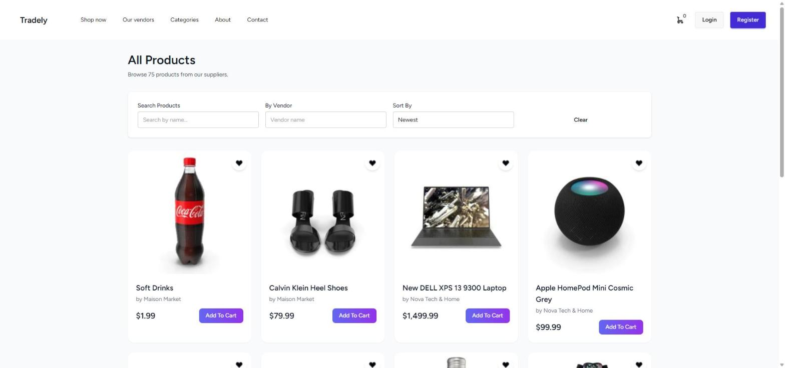
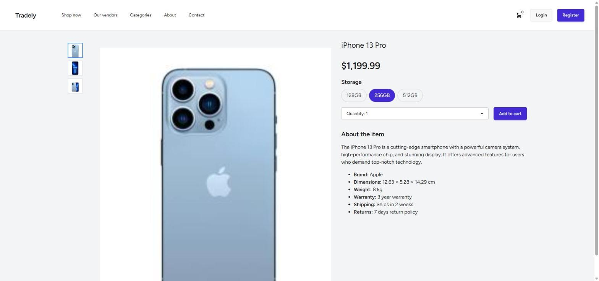
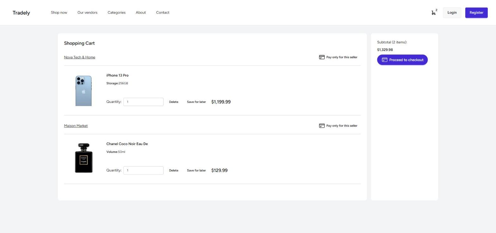
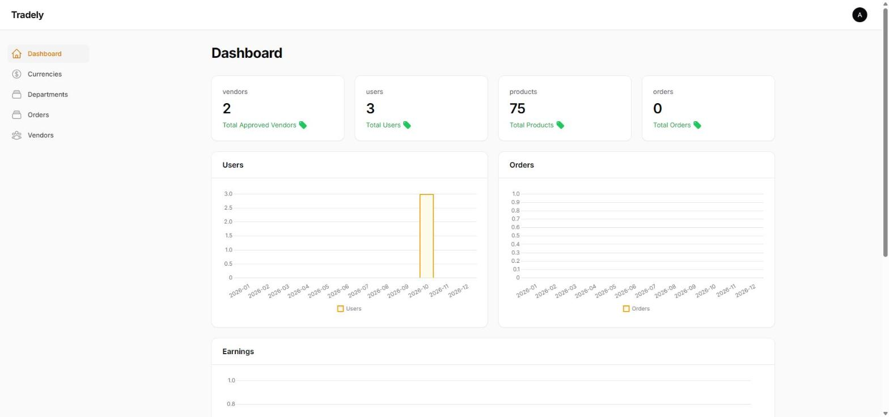
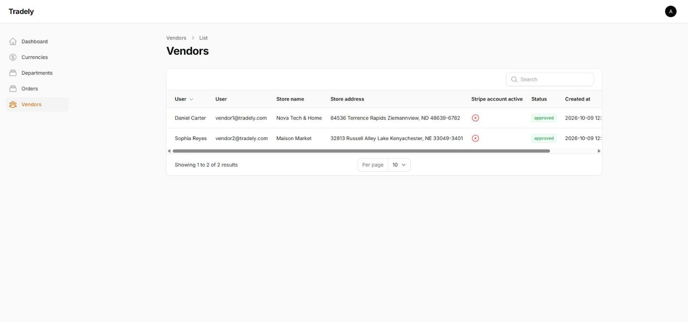
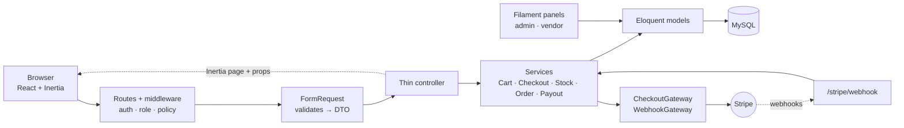
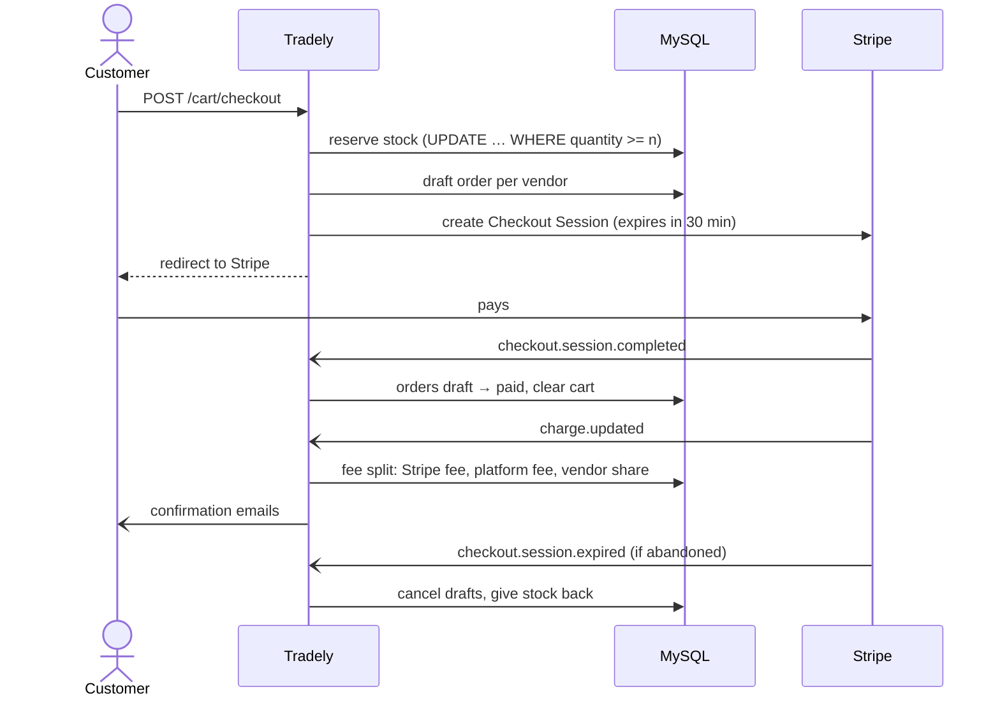

<h1 align="center">Tradely</h1>

<p align="center">
  A multi-vendor marketplace built with Laravel, React and Stripe:
  customers shop across many stores in one cart, vendors run their own back office,
  and the platform takes a commission before paying vendors out through Stripe Connect.
</p>

<p align="center">
  <a href="https://tradely-ub17.onrender.com"><strong>Live demo</strong></a> ·
  <a href="#demo-accounts">Demo accounts</a> ·
  <a href="#getting-started">Run it locally</a> ·
  <a href="#architecture">Architecture</a>
</p>

<p align="center">
  
  
  
  
  
  
  
</p>



---

## Contents

- [Features](#features)
- [Screenshots](#screenshots)
- [Tech stack](#tech-stack)
- [Architecture](#architecture)
- [Engineering highlights](#engineering-highlights)
- [Getting started](#getting-started)
- [Testing](#testing)
- [Deployment](#deployment)
- [Project structure](#project-structure)

## Features

**Customers**
- Browse 75 demo products across departments and categories, search, filter by vendor and sort by price or date
- Product variations (storage, size, volume…) with their own price and stock
- One cart for many vendors, kept in a cookie for guests and merged into the account on login
- Pay for everything at once or per vendor through Stripe Checkout
- Order history with status, totals and line items

**Vendors**
- Apply to become a vendor from the profile page
- A Filament back office scoped to their own store: products, images, variation types, per-variation price and stock, orders, sales charts
- Stripe Connect Express onboarding to receive payouts

**Admins**
- Dashboard with vendors, users, products, orders and earnings
- Approve or reject vendors, manage departments, categories and currencies

**Platform**
- Stock is reserved when checkout starts and released if the payment never happens, so the same units can never be sold twice
- Stripe webhooks mark orders paid, split each payment into Stripe fee, platform commission and vendor share, and email the vendor and customer
- Monthly vendor payouts in cents, with an idempotency key per payout period

## Screenshots

| Product catalog | Product page with variations |
|---|---|
|  |  |

| Cart split by vendor | Admin dashboard |
|---|---|
|  |  |

| Admin vendor approval | |
|---|---|
|  | |

## Tech stack

| Layer | Technology |
|---|---|
| Backend | Laravel 12, PHP 8.3 (strict types throughout) |
| Frontend | React 18 + Inertia.js 2, Tailwind CSS 3 + daisyUI, Vite 6 |
| Back offices | Filament 3 (separate admin and vendor panels) |
| Payments | Stripe Checkout (payments), Stripe Connect Express (vendor payouts) |
| Auth & roles | Laravel Breeze, spatie/laravel-permission |
| Media | spatie/laravel-medialibrary |
| Database | MySQL 8 (Aiven in production) |
| Tests | Pest 3 on a MySQL test database, `node:test` for frontend helpers |
| Code style | Laravel Pint (`composer lint`) |
| Hosting | Docker on Render |

## Architecture

Every storefront request follows the same layered path, and anything that talks to Stripe sits behind a small gateway interface so it can be faked in tests:



Checkout is split into a synchronous half (reserve stock, create draft orders, open a Stripe session, all in one transaction) and an asynchronous half driven by Stripe webhooks:



## Engineering highlights

- **No overselling under concurrency.** Stock is taken with a single conditional `UPDATE … SET quantity = quantity - n WHERE quantity >= n` inside the checkout transaction, so two customers can never both buy the last units. A `CHECK (quantity >= 0)` constraint backs it up in MySQL, and a dedicated concurrency test suite reproduces the race with two real database connections.
- **Idempotent webhooks.** Each Stripe event only acts on orders still in the right state, under row locks, so duplicate deliveries do nothing: stock is never reduced twice and emails are sent once.
- **Correct money handling.** Payout transfers are sent in cents with rounding, each payout period is half-open so an order is never paid twice, and every transfer carries an idempotency key and is recorded with its Stripe transfer id.
- **Thin controllers.** All business logic lives in services; controllers receive validated DTOs from FormRequests. Stripe is accessed through `CheckoutGateway` / `WebhookGateway` interfaces with fakes in tests.
- **Security.** Order ownership via policies, vendor-scoped back office queries, product descriptions sanitized before they are rendered as HTML, no global mass-assignment unguarding, webhook signature verification.
- **Performance.** Product listings eager-load everything a product card needs, so the home page uses the same number of queries for 2 or 2,000 products.

## Getting started

### Requirements

- PHP 8.2+ with `pdo_mysql`, `intl`, `gd`, `exif`, `zip`, `bcmath`
- Composer 2, Node 20+
- MySQL 8
- Optional: [Laravel Herd](https://herd.laravel.com) and the [Stripe CLI](https://stripe.com/docs/stripe-cli) for local payments

### Setup

```bash
git clone https://github.com/OpadaAlzaiede/laravel-react-ecommerce.git
cd laravel-react-ecommerce

composer install
npm install

cp .env.example .env
php artisan key:generate
```

Set your database credentials in `.env`, then create the schema and the demo data (users, categories, 75 products with images):

```bash
php artisan migrate --seed
php artisan storage:link
```

Run the app:

```bash
composer dev
```

This starts the Laravel server, a queue listener and Vite together. With Herd, the site is also available at `http://laravel-react-ecommerce.test`.

### Payments in development

Add Stripe **test** keys to `.env` (`STRIPE_KEY`, `STRIPE_SECRET`) and forward webhooks to your machine:

```bash
stripe listen --forward-to http://laravel-react-ecommerce.test/stripe/webhook
```

Put the printed `whsec_…` value into `STRIPE_WEBHOOK_SECRET`. Pay with the test card `4242 4242 4242 4242`, any future date and any CVC.

### Demo accounts

All seeded accounts use the password `password`.

| Role | Email |
|---|---|
| Admin (`/admin`) | `admin@tradely.com` |
| Vendor (`/vendor`), Nova Tech & Home | `vendor1@tradely.com` |
| Vendor (`/vendor`), Maison Market | `vendor2@tradely.com` |
| Customer | `user1@tradely.com`, `user2@tradely.com`, `user3@tradely.com` |

## Testing

The test suite runs against a dedicated MySQL database so it exercises the same JSON queries and row locks as production. Create it once:

```sql
CREATE DATABASE laravel_react_ecommerce_test CHARACTER SET utf8mb4 COLLATE utf8mb4_unicode_ci;
```

```bash
php artisan test        # Pest: Feature, Unit and Concurrency suites
npm run test:js         # frontend helpers with node:test
composer lint:check     # Pint code style
```

The `Concurrency` suite uses `DatabaseTruncation` instead of transactions, so it can commit data from a second connection and reproduce real checkout races.

## Deployment

The repository includes a `Dockerfile` and a Render Blueprint (`render.yaml`).

1. Create a MySQL database (for example on [Aiven](https://aiven.io)) and download its CA certificate.
2. In Render, choose **New → Blueprint** and select this repository.
3. Fill in the secrets: `APP_KEY`, `APP_URL`, the `DB_*` values, `MYSQL_SSL_CA_PEM` (the full certificate) and the three `STRIPE_*` keys.
4. In Stripe, add a webhook endpoint for `https://<your-app>/stripe/webhook` with the events `checkout.session.completed`, `charge.updated` and `checkout.session.expired`.

On every boot the container starts Apache right away and rebuilds the demo database in the background (`DEMO_RESET_ON_BOOT=true`), so the public demo always starts clean. Products appear a few minutes after a cold start.

## Project structure

```
app/
├── Console/Commands/      pay:vendors, orders:release-stale-reservations
├── Contracts/Payments/    CheckoutGateway, WebhookGateway
├── DTOs/                  validated input passed from requests to services
├── Filament/              admin and vendor back offices
├── Http/
│   ├── Controllers/       thin controllers
│   ├── Requests/          validation + toDto()
│   └── Resources/         API resources for Inertia props
├── Models/
├── Policies/              OrderPolicy
├── Rules/                 CompleteOptionSelection
└── Services/              business logic (Cart, Checkout, Stock, Order, Payout, StripeWebhook…)
database/seeders/data/     demo catalog with pre-built product images
docker/                    container entrypoint
resources/js/              React pages and components
tests/
├── Feature/               HTTP, Filament and service tests
├── Concurrency/           two-connection race tests
└── js/                    node:test tests for frontend helpers
```

## License

MIT
